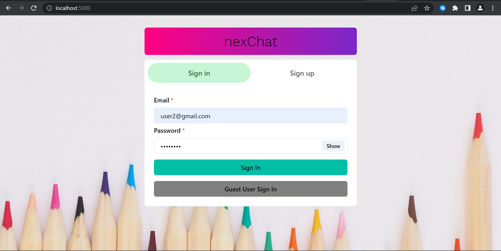

# nexChat
A real-time chat application built with MERN stack that allows users to chat with each other in real time.


## Project setup
To set up the project on your local machine, you need to have MongoDB installed on your PC, or you can also use MongoDB Atlas, the cloud version of MongoDB. Create an account [here](https://www.mongodb.com/). Create a cluster and copy the connection uri in order to connect with your cluster from within your local environment. More details an be found [here](https://www.mongodb.com/docs/drivers/node/current/fundamentals/connection/connect/#std-label-node-connect-to-mongodb).

Next, you need to have a Cloudinary account in order to store user images. Create an acount [here](https://cloudinary.com/). Log into your account and create an API key.

Now, you can clone the repository:
```
git clone https://github.com/AyobamiAdebesin/nexchat-MERN
```
In the root of the project folder, install the backend dependenies by running
```
npm install
```
Next, you will install the frontend dependencies in a new terminal and running:
```
cd frontend
```
```
npm install
```

Create a .env file to store your environment variables:
```
PORT=<Your port for your backend>
MONGO_URI=<mongo uri>
```

To start the backend, open the terminal where the backend dependencies was installed and run:

```
npm start
```

To start the frontend, open the terminal where the frontend dependencies was installed and run:
```
npm start
```

You can view the application on your localhost by visiting
```
 http://localhost:3000
```
in your browser.

```

### Compiles and minifies for production
```
npm run build
```

### Lints and fixes files
```
npm run lint
```

### Screenshots
